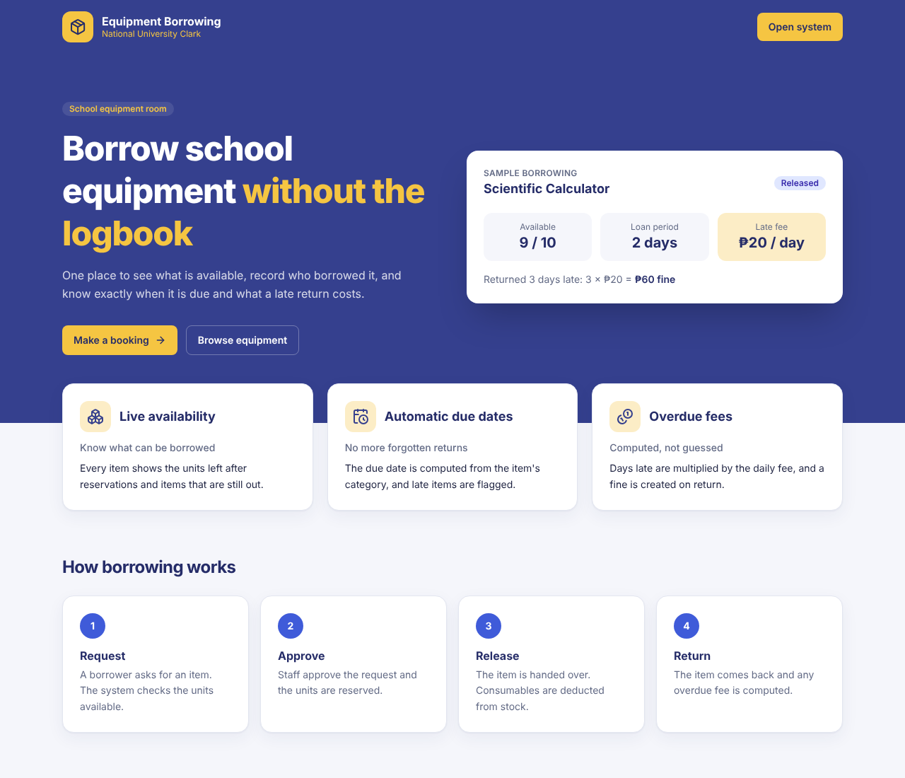
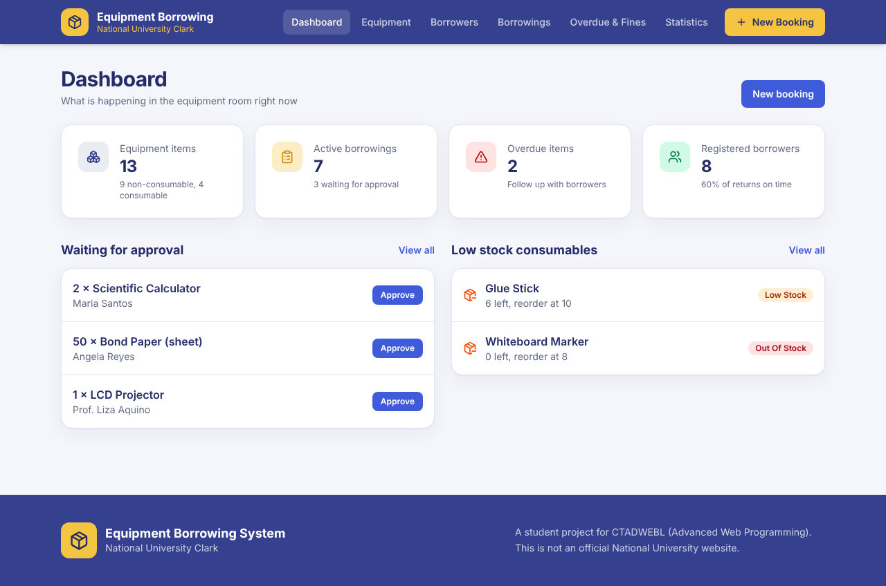
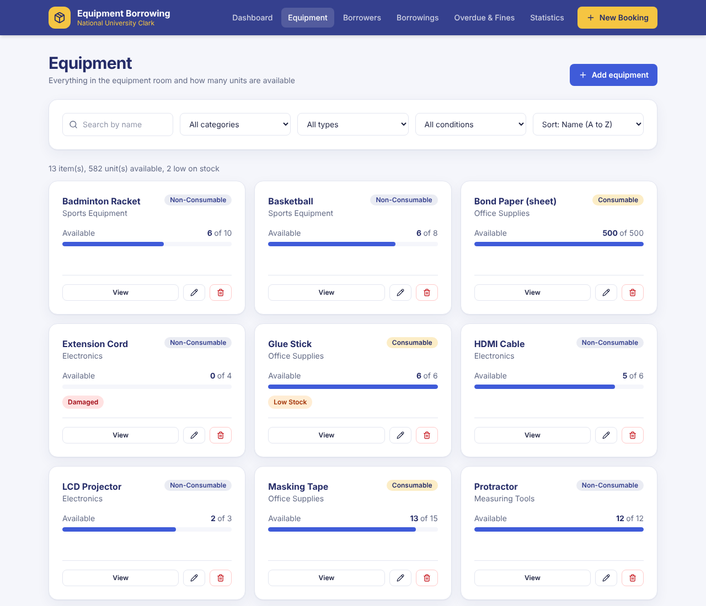
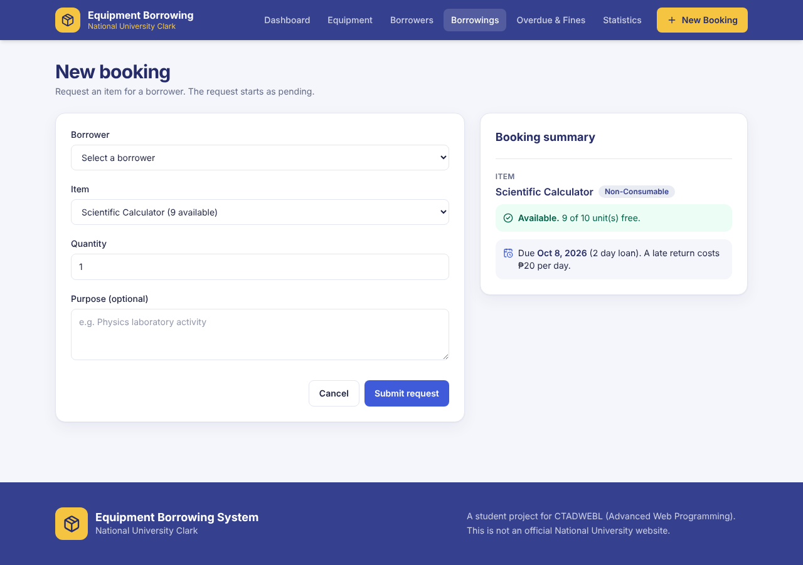
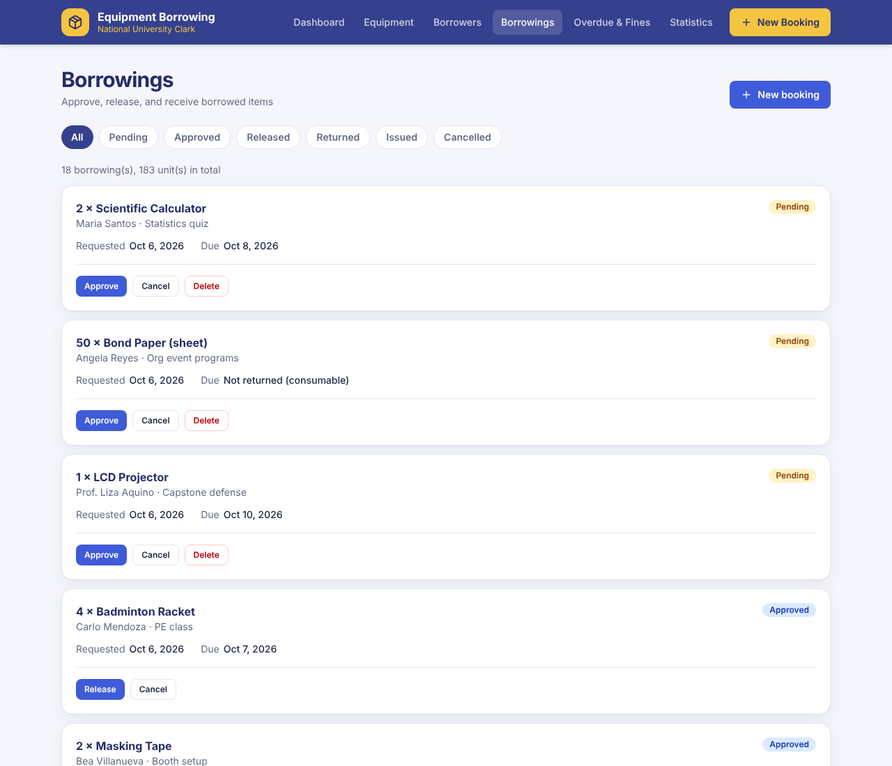
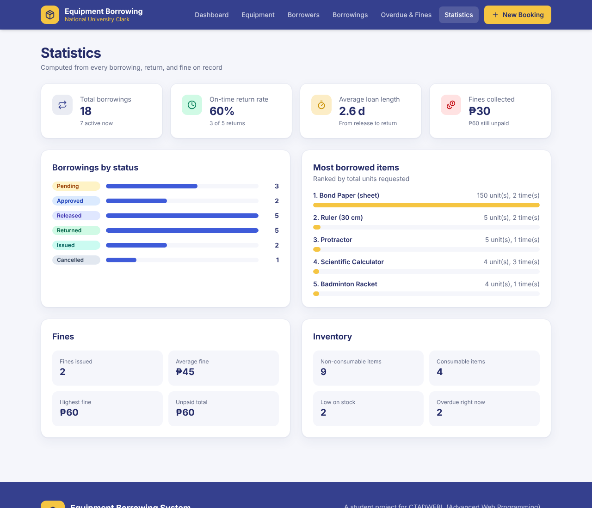

# School Equipment Borrowing System — Frontend

The React frontend of the School Equipment Borrowing System, a final project for
CTADWEBL (Advanced Web Programming), National University Clark, A.Y. 2026-2027.

The API (Express and MongoDB) lives in the `backend` folder, which is pushed to its own repository: `equipment-borrowing-server`.

> This is a student project. It is not an official National University website.

## Group members

| Name | Role | GitHub |
|---|---|---|
| _Member 1_ | _e.g. Booking and borrowings pages_ | _@username_ |
| _Member 2_ | _e.g. Equipment pages_ | _@username_ |
| _Member 3_ | _e.g. Dashboard, statistics, landing_ | _@username_ |

## Concept

A school equipment room lends items to students and faculty. This system replaces
the paper logbook: it shows what is available, records who borrowed what, computes
the due date, flags overdue items, and computes the overdue fee.

## What the application does

| # | Page | Path | What it does |
|---|---|---|---|
| 1 | Landing | `/` | Introduces the system |
| 2 | Dashboard | `/dashboard` | Summary counts, pending requests, low-stock consumables |
| 3 | Equipment list | `/equipment` | Search, filter, and sort the inventory; manage categories |
| 4 | Equipment detail | `/equipment/:id` | One item, an availability checker, and its history |
| 5 | Equipment form | `/equipment/new`, `/equipment/:id/edit` | Add or edit an item |
| 6 | Borrowers | `/borrowers` | List, add, edit, delete, and view each borrower's standing |
| 7 | Booking screen | `/borrowings/new` | Create a request with a live availability and due date summary |
| 8 | Borrowings | `/borrowings` | Approve, release, issue, return, cancel, and delete |
| 9 | Overdue and fines | `/overdue` | Late items with running fees; mark fines as paid |
| 10 | Statistics | `/statistics` | On-time rate, most borrowed items, fine totals |
| — | Not found | any other path | 404 page |

## Screenshots

| Landing | Dashboard |
|---|---|
|  |  |

| Equipment | Booking |
|---|---|
|  |  |

| Borrowings | Statistics |
|---|---|
|  |  |

## Technologies

React (Vite) with TypeScript, Tailwind CSS, React Router, React Hook Form with Zod, axios.

## Project structure

```
src/api/axios.ts     the single configured axios instance
src/hooks/           custom hooks: useFetch, useDebounce, useToast
src/schemas/         Zod schemas for every form
src/components/      shared pieces: Layout, StatusBadge, ConfirmDialog, ...
src/pages/           one file per page
src/context/         toast messages
src/types.ts         TypeScript types of the API records
src/index.css        Tailwind theme (the blue and gold palette)
```

## Setup

1. Start the backend first (see the backend README).
2. Install the packages:
   ```bash
   npm install
   ```
3. Start the client:
   ```bash
   npm run dev
   ```
   Open `http://localhost:5173`.

## Environment variables

| Variable | Purpose | Example |
|---|---|---|
| `VITE_API_URL` | Optional. Base URL of the API | `http://localhost:5000/api` |

No `.env` file is needed. Without `VITE_API_URL`, the client calls the API on the
same computer that serves the page, on port 5000.

## Web and mobile

The interface is responsive and was checked at 320, 375, 414, 768, and 1280 pixels
wide with no horizontal scrolling. Buttons and fields are at least 36px tall for
touch, and the navigation becomes a menu button on small screens.

To open it on a real phone (same Wi-Fi as the laptop):

1. On the backend, keep `CLIENT_URL=*` in `.env`.
2. Run `npm run dev`. The terminal prints a **Network** address such as `http://192.168.1.5:5173`.
3. Open that address in the phone's browser.

## The logo

The header and footer show `public/nu-logo.png`. To change the logo, replace that
file and keep the same name. If the file is missing, a placeholder icon is shown.

## Features

- Ten pages with React Router, plus a 404 page
- One axios instance for every API call
- Loading, error, and empty states on every screen that loads data
- Forms with React Hook Form and Zod, with per-field error messages
- A confirmation step before every delete
- Success and error messages after every create, update, and delete
- Derived values computed during render (totals, percentages, due date preview)
- Custom hooks in `src/hooks`
- Responsive from 320px phones to desktop, with a custom Tailwind theme

## Known limitations

- There is no login; every visitor has staff access.
- The page does not refresh by itself when another user changes the data.
- The fonts load from Google Fonts, so they fall back to system fonts when offline.
